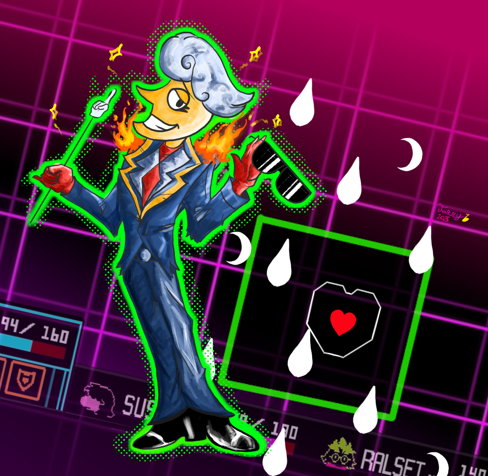

<table>
  <tr>
    <td width="150">
      
    </td>
    <td>
      <h1>👋 Ciao, sono Luca Rossi</h1>
      
🎓 Studente di Informatica 
      💻 Appassionato di C++, AI e tecnologie open-source 
      📫 Contattami su <a href="https://lucarossi.dev">lucarossi.dev</a>

    </td>
  </tr>
</table>

<!--
Hello Everyone !

- 🪐My Main Purposes
  <>I'm SafeCircle, and I'm currently leaarning 
    how to create games in the Game Maker Engine; (lol)

- ⚡Other Activities
  <>Since I like to Develop games, I've also learned how to
    use:
   -FL Studio (to compose music);
   -Aseprite (to create, and animate pixel arts);
  
- 🔭Hobbies
  <>As hobbies, right now I'm learning C++ and sometimes
    a bit of Assembly; (I'm going insane :>)
  <>I even love Math and I'm learning how to play the Piano
    (mostly Classic Music);
  
- 🎩Other [maybe useful] links:
- 😄[My Instagram Page](https://www.instagram.com/frisk_and_freddy_fazbear._/)
- 🕴️[My YouTube Channel](https://www.youtube.com/@jazzyBeing)

- An Ending:
  <>Now feel free to look up the things I did...
    (haven't done anything interesting yet, buuuut...)
    (you get the Idea :>)
